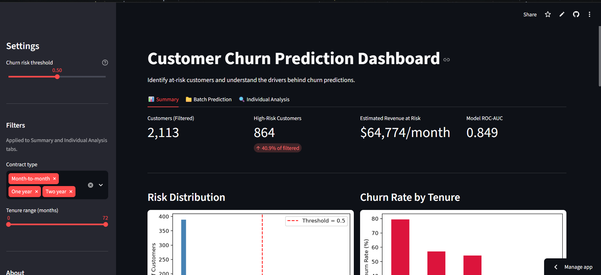

# Customer Churn Prediction Dashboard

**[Live Demo](https://joel-customer-churn-prediction.streamlit.app/)** | Built by Joel Chriscendo Rahardjo Liem



An end-to-end machine learning project that predicts customer churn for a telecom company, explains individual predictions with SHAP, and surfaces the results through an interactive dashboard for retention decision-making.

## Problem

Telecom companies lose recurring revenue when customers churn. Identifying at-risk customers early, and understanding *why* they're at risk, allows retention teams to act before it's too late rather than analyzing churn after the fact.

## Dataset

- **Source:** [Telco Customer Churn (Kaggle)](https://www.kaggle.com/datasets/blastchar/telco-customer-churn)
- 7,043 customers, 21 original features (demographics, account info, services subscribed)
- Target: Churn (Yes/No), 26.5% positive class

## Approach

1. **EDA** — identified tenure, contract type, internet service type, and payment method as the strongest churn signals
2. **Preprocessing** — categorical encoding, feature scaling, class imbalance handled via class weights
3. **Feature engineering** — added interaction features based on EDA insights (limited additional lift observed, documented as a finding rather than discarded silently)
4. **Modeling** — trained and tuned Logistic Regression, Random Forest, XGBoost, and LightGBM; combined the best performers into a Stacking Ensemble
5. **Explainability** — SHAP values (on the XGBoost base learner) used to validate model behavior against manual EDA findings and explain individual predictions
6. **Deployment** — interactive Streamlit dashboard with three views: portfolio-level summary, batch prediction, and individual customer explanation

## Results

| Model | ROC-AUC | Accuracy | Precision | Recall | F1 |
|-------|---------|----------|-----------|--------|-----|
| Logistic Regression | 0.848 | 0.745 | 0.513 | 0.793 | 0.623 |
| XGBoost (Tuned) | 0.846 | 0.753 | 0.523 | 0.809 | 0.635 |
| Random Forest (Tuned) | 0.843 | 0.767 | 0.541 | 0.800 | 0.646 |
| **Stacking Ensemble (Final)** | **0.849** | **0.754** | **0.524** | **0.807** | **0.636** |

These results are consistent with published benchmarks on the same dataset (community projects using similar or more elaborate approaches, including stacked gradient boosting with Optuna tuning, report ROC-AUC in the same 0.83-0.86 range), suggesting this dataset has a natural performance ceiling for standard tabular modeling approaches.

**Top churn drivers (SHAP):** Two-year contract, tenure, Fiber optic internet service, One-year contract, monthly charges.

## Dashboard Features

- **Summary:** portfolio-level churn risk, revenue at risk, churn-by-tenure breakdown, retention campaign ROI simulator
- **Batch Prediction:** upload a CSV or use sample data to score multiple customers, filter by risk level, download results
- **Individual Analysis:** select any customer, see their churn probability, SHAP waterfall explanation, and suggested retention actions

## Known Limitations

- The stacking ensemble is not directly SHAP-explainable with TreeExplainer; SHAP values are computed on the XGBoost base learner as a proxy
- Batch prediction expects data already in the model's preprocessed (encoded and scaled) format; a production version would include an automated preprocessing pipeline for raw input
- Engineered features provided minimal performance lift over the original feature set, likely because tree-based models already captured similar interactions internally
- Random Forest shows a larger train-test generalization gap (0.084) than XGBoost, even after tuning

## Tech Stack

Python, pandas, scikit-learn, XGBoost, LightGBM, SHAP, Streamlit, matplotlib/seaborn

## Project Structure
```
customer-churn-prediction/
├── data/raw/                  # Original dataset
├── data/processed/splits/     # Train-test splits used by the app
├── notebooks/                 # EDA, preprocessing, and modeling notebooks
├── src/app.py                 # Streamlit dashboard
├── models/                    # Trained models, scaler, SHAP artifacts
└── requirements.txt
```

## Run Locally

```bash
git clone https://github.com/Joelcrl/customer-churn-prediction.git
cd customer-churn-prediction
pip install -r requirements.txt
streamlit run src/app.py
```

## Future Improvements

- Automated preprocessing pipeline for raw customer data input
- Deep dive into SHAP explainability directly on the stacking meta-learner
- A/B test framework to validate retention campaign impact against the model's predictions