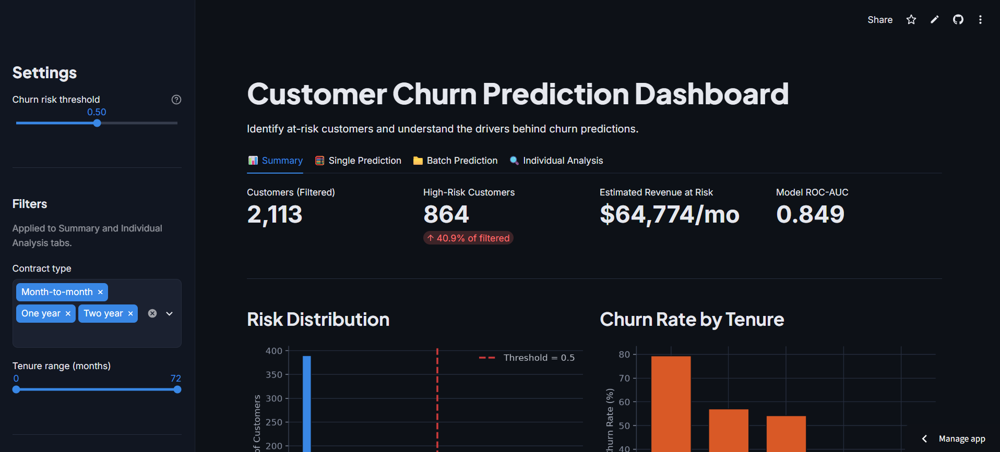

# Customer Churn Prediction Dashboard

**[Live Demo](https://joel-customer-churn-prediction.streamlit.app/)** | Built by Joel Chriscendo Rahardjo Liem



An end-to-end machine learning project that predicts customer churn for a telecom company, explains individual predictions with SHAP, and surfaces the results through an interactive dashboard for retention decision-making.

## Problem

Telecom companies lose recurring revenue when customers churn. Identifying at-risk customers early, and understanding *why* they're at risk, allows retention teams to act before it's too late rather than analyzing churn after the fact.

## Dataset

- **Source:** [Telco Customer Churn (Kaggle)](https://www.kaggle.com/datasets/blastchar/telco-customer-churn)
- 7,043 customers, 21 original features (demographics, account info, services subscribed)
- Target: Churn (Yes/No), 26.5% positive class

## Approach

1. **EDA**: Identified tenure, contract type, internet service type, and payment method as the strongest churn signals
2. **Preprocessing**: Categorical encoding, feature scaling, class imbalance handled via class weights
3. **Feature engineering**: Added interaction features based on EDA insights (limited additional lift observed, documented as a finding rather than discarded silently)
4. **Modeling**: Trained and tuned Logistic Regression, Random Forest, XGBoost, and LightGBM; combined the best performers into a Stacking Ensemble
5. **Explainability**: SHAP values (on the XGBoost base learner) used to validate model behavior against manual EDA findings and explain individual predictions
6. **Deployment**: Interactive Streamlit dashboard with four views: portfolio-level summary, single-customer what-if prediction, batch scoring of raw customer data, and individual customer explanation
7. **Pipeline verification**: The app reuses the notebook preprocessing in `src/preprocess.py`; `notebooks/pipeline_verification.ipynb` rebuilds the full test set from raw data through that module and confirms it matches the training features exactly

## Results

| Model | ROC-AUC | Accuracy | Precision | Recall | F1 |
|-------|---------|----------|-----------|--------|-----|
| Logistic Regression | 0.848 | 0.745 | 0.513 | 0.793 | 0.623 |
| XGBoost (Tuned) | 0.846 | 0.753 | 0.523 | 0.809 | 0.635 |
| Random Forest (Tuned) | 0.843 | 0.767 | 0.541 | 0.800 | 0.646 |
| **Stacking Ensemble (Final)** | **0.849** | **0.754** | **0.524** | **0.807** | **0.636** |

These results are consistent with published benchmarks on the same dataset (community projects using similar or more elaborate approaches, including stacked gradient boosting with Optuna tuning, report ROC-AUC in the same 0.83-0.86 range), suggesting this dataset has a natural performance ceiling for standard tabular modeling approaches.

**Top churn drivers (SHAP):** Two-year contract, tenure, Fiber optic internet service, One-year contract, monthly charges.

## Dashboard Features

- **Summary:** portfolio-level churn risk, revenue at risk, churn-by-tenure breakdown, retention campaign ROI simulator
- **Single Prediction:** enter one customer's details and get their churn probability, risk level, SHAP explanation, and suggested actions. Works as a what-if tool: for a default month-to-month Fiber optic customer, switching the contract to two years lowers predicted churn from 78.8% to 38.9%
- **Batch Prediction:** upload a CSV in the original Telco format (a downloadable template and column guide are included) or use sample data; invalid values are rejected with a clear message, and results can be filtered by risk level and downloaded with `customerID` preserved
- **Individual Analysis:** select any customer, see their churn probability, SHAP waterfall explanation, and suggested retention actions

## Known Limitations

- The stacking ensemble is not directly SHAP-explainable with TreeExplainer; SHAP values are computed on the XGBoost base learner as a proxy
- In Single Prediction, TotalCharges is estimated as tenure x monthly charges, so it ignores past price changes that a real billing history would reflect
- Engineered features provided minimal performance lift over the original feature set, likely because tree-based models already captured similar interactions internally
- Random Forest shows a larger train-test generalization gap (0.084) than XGBoost, even after tuning

## Tech Stack

Python, pandas, scikit-learn, XGBoost, LightGBM, SHAP, Streamlit, matplotlib/seaborn

## Project Structure
```
customer-churn-prediction/
├── data/raw/                  # Original dataset
├── data/processed/splits/     # Train-test splits used by the app
├── notebooks/                 # EDA, preprocessing, modeling, and pipeline verification
├── src/app.py                 # Streamlit dashboard
├── src/preprocess.py          # Raw-data pipeline shared by the app (validation, encoding, scaling)
├── .streamlit/config.toml     # Dashboard theme
├── models/                    # Trained models, scaler, SHAP artifacts
└── requirements.txt
```

## Run Locally

Requires Python 3.12 or newer (the pinned XGBoost version does not support older releases).

```bash
git clone https://github.com/Joelcrl/customer-churn-prediction.git
cd customer-churn-prediction
pip install -r requirements.txt
streamlit run src/app.py
```

## Future Improvements

- Deep dive into SHAP explainability directly on the stacking meta-learner
- A/B test framework to validate retention campaign impact against the model's predictions
- Choose the risk threshold from retention campaign cost and value rather than the default 0.5